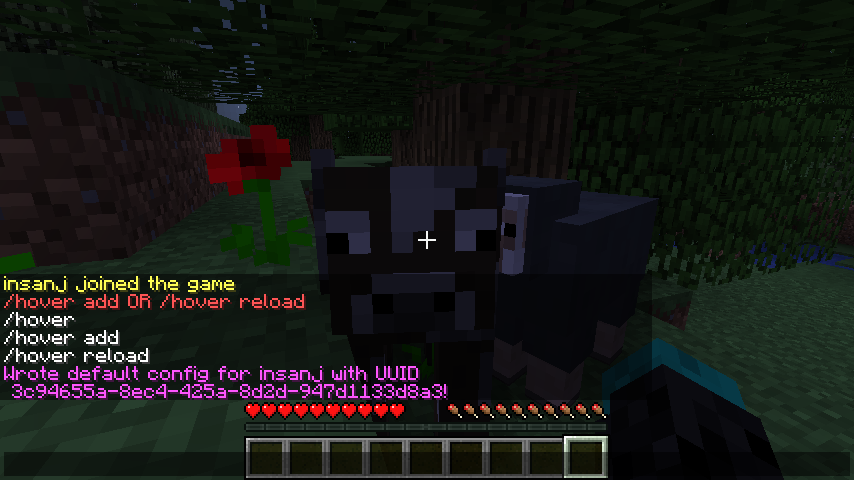
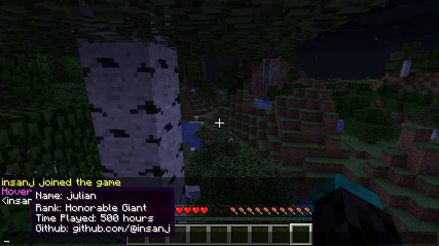

<h3 align="center">
  👈
<br/><br/>
hover
<br/>
hover over a user in minecraft chat to see info about them
</h3>

<p align="center">
  <a href="https://github.com/insanj/portal/releases">
    
  </a>

  <a href="https://github.com/insanj/portal/">
    
  </a>

  <a href="https://github.com/insanj/portal/blob/master/LICENSE">
    
  </a>

  <br/>

  <a href="https://jdk.java.net/">
    
  </a>
  
  <a href="https://getbukkit.org/download/craftbukkit">
    
  </a>
  
  <a href="https://bukkit.org/threads/hover-info.478813/">
    
  </a>
</p>

## How to Play

- install and run `hover` on your server
- setup player information in the auto-generated `/plugins/hover/config.yml` file
- hover your mouse over a player name in chat to see the tooltip info

### Commands

Each of these commands requires a corresponding `hover.` permission [in the permissions.yml file](#example--permissions-yml--), such as `hover.add` or `hover.reload`. All operators can run all Hover commands.

- use `/hover add` to add a default config entry for yourself
- use `/hover reload` to reload configuration file without restarting server
- use `/hover stop` to stop the plugin
- use `/hover start` to start the plugin after stopping it

### Example `/plugins/hover/config.yml`

```yaml
insanj:
  Name: Example
  Time Played: 857 hours
  Blood Status: Half-Blood
```

### Example `permissions.yml`

```yaml
users:
    insanj:
        permissions:
            -'hover.add'
```

### Screenshots




## Acknowledgements

- [Chat Component API](https://www.spigotmc.org/wiki/the-chat-component-api/)
- [Item Tooltips](https://www.spigotmc.org/threads/tut-item-tooltips-with-the-chatcomponent-api.65964/)
- [Help with ChatSerializer](https://www.spigotmc.org/threads/help-with-chatserializer.43924/)
- [Error ChatSerializer](https://www.spigotmc.org/threads/error-chatserializer.158929/)
- [Send User Clickable Link](https://stackoverflow.com/questions/34635271/minecraft-bukkit-plugins-send-user-a-clickable-link)
- [How Can I Override Chat Events](https://bukkit.org/threads/how-can-i-override-chat-events.113085/)
- [Overriding Commands](https://bukkit.org/threads/overriding-commands.58934/)
- [PacketPlayOutTitle Problem](https://bukkit.org/threads/packetplayouttitle-problem.388348/)
- [Convert Tellraw JSON to ChatSerializer](https://www.spigotmc.org/threads/convert-tellraw-json-to-chat-serializer.84912/)
- [Hover Text](https://www.spigotmc.org/threads/hover-text.259032/)
- [Hover Over Players Name](https://www.spigotmc.org/threads/hover-over-players-name.194490/)

## Authors

Julian Weiss, github.com/insanj

## License

```
MIT License

Copyright (c) 2019 Julian Weiss

Permission is hereby granted, free of charge, to any person obtaining a copy
of this software and associated documentation files (the "Software"), to deal
in the Software without restriction, including without limitation the rights
to use, copy, modify, merge, publish, distribute, sublicense, and/or sell
copies of the Software, and to permit persons to whom the Software is
furnished to do so, subject to the following conditions:

The above copyright notice and this permission notice shall be included in all
copies or substantial portions of the Software.

THE SOFTWARE IS PROVIDED "AS IS", WITHOUT WARRANTY OF ANY KIND, EXPRESS OR
IMPLIED, INCLUDING BUT NOT LIMITED TO THE WARRANTIES OF MERCHANTABILITY,
FITNESS FOR A PARTICULAR PURPOSE AND NONINFRINGEMENT. IN NO EVENT SHALL THE
AUTHORS OR COPYRIGHT HOLDERS BE LIABLE FOR ANY CLAIM, DAMAGES OR OTHER
LIABILITY, WHETHER IN AN ACTION OF CONTRACT, TORT OR OTHERWISE, ARISING FROM,
OUT OF OR IN CONNECTION WITH THE SOFTWARE OR THE USE OR OTHER DEALINGS IN THE
SOFTWARE.
```
